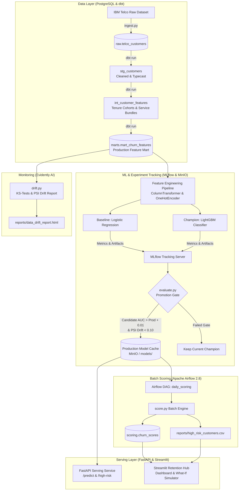

# 🔄 End-to-End Customer Churn Prediction & Retention MLOps Pipeline

[](https://github.com/Alokkr00/Customer-Churn-Pipeline/actions)
[](https://www.python.org/)
[](https://fastapi.tiangolo.com)
[](https://streamlit.io)
[](https://www.getdbt.com/)
[](https://mlflow.org/)
[](https://airflow.apache.org/)
[](https://www.docker.com/)
[](https://github.com/psf/black)

A production-grade, end-to-end Machine Learning Operations (**MLOps**) and Data Engineering system designed to predict customer churn, explain individual risk drivers, and automate proactive retention campaigns for recurring subscription and SaaS businesses.

---

## 📑 Table of Contents
- [Business Problem & ROI](#-business-problem--roi)
- [System Architecture](#-system-architecture)
- [Key Features](#-key-features)
- [Tech Stack](#-tech-stack)
- [Project Layout](#-project-layout)
- [Quickstart Guide](#-quickstart-guide)
- [REST API Reference (FastAPI)](#-rest-api-reference-fastapi)
- [Interactive Retention Hub (Streamlit)](#-interactive-retention-hub-streamlit)
- [Model Governance & Promotion Gate](#-model-governance--promotion-gate)
- [Testing & Code Quality](#-testing--code-quality)
- [Roadmap](#-roadmap)

---

## 💼 Business Problem & ROI

### The Challenge
In recurring subscription businesses (telecoms, SaaS, streaming services), customer churn directly erodes customer lifetime value (LTV). Acquiring a new customer costs **5–7× more** than retaining an existing one. Reactive retention strategies (calling customers *after* they cancel) fail because churn signals develop weeks in advance.

### The Solution
An automated, closed-loop MLOps pipeline that:
1. **Identifies Vulnerability Early**: Scans customer activity and contract patterns daily to score churn probability.
2. **Diagnoses Why**: Isolates top individual risk drivers (e.g. month-to-month contracts, missing tech support, high recurring charges) for transparent, explainable AI.
3. **Automates Actionable Interventions**: Maps risk factors directly to prioritized retention campaigns (e.g. 15% discount for 12-month lock-in, complimentary tech support).
4. **Protects Production Quality**: Enforces strict automated promotion gates ($\Delta\text{AUC} \ge +0.01$ and Population Stability Index $\le 0.10$) before any model reaches serving.

### Business & ML Success Metrics
- **Target ROC-AUC**: $\ge 0.84$ on unseen holdout sets.
- **Precision@20%**: Measures the churn concentration in the top quintile highest-risk customers flagged for proactive outreach.
- **Revenue at Risk Protected**: Identifies high-risk customer accounts to prioritize high-touch retention campaigns.
- **Prediction Latency**: Sub-30ms real-time inference via FastAPI.

---

## 🏗️ System Architecture



---

## 🌟 Key Features

* **Dynamic Platform-Agnostic Directory Resolution**: Custom path engine (`src/utils/paths.py`) that auto-discovers repository root and works seamlessly across Windows, macOS, Linux, Docker, and Airflow worker environments.
* **Modular dbt Models**: Staging, intermediate, and marts layers with unit schema constraints (`unique`, `not_null`, `accepted_values`).
* **Automated Production Quality Gate**: Replaces manual deployments with code-enforced promotion criteria based on both performance gain and population drift.
* **Explainable Risk Diagnostics**: Provides human-readable churn risk reasons per customer for transparent customer support action.
* **What-If Retention Strategy Simulator**: Interactive Streamlit simulator allowing retention teams to test how plan adjustments (e.g. extending contract duration or bundling tech support) lower a customer's churn risk.
* **Full CI/CD Pipeline**: GitHub Actions running code formatting (Ruff/Black), unit test verification, and dbt compile checks on every pull request.

---

## 🛠️ Tech Stack

| Layer | Technology | Purpose |
|---|---|---|
| **Local Infrastructure** | Docker Compose | 1-command spinup of PostgreSQL 15, MinIO, MLflow, and Apache Airflow |
| **Data Storage** | PostgreSQL 15 | Relational data warehouse, raw storage, feature mart, and churn scores |
| **Data Transformation** | dbt-core + dbt-postgres | SQL transformations, schema testing, and lineage tracking |
| **ML Modeling** | LightGBM, Scikit-learn | Gradient boosted trees and benchmark linear models |
| **Experiment Tracking** | MLflow + MinIO | Run parameters, metrics, artifact logging, and model registry |
| **Orchestration** | Apache Airflow 2.8 | Scheduled daily scoring pipeline and risk volume alerts |
| **Real-Time Serving** | FastAPI + Uvicorn | High-performance REST endpoints with Pydantic validation |
| **Retention UI** | Streamlit | Executive KPI dashboard, risk cohort table, and retention simulator |
| **Data Quality & Drift** | Evidently AI + Scipy | Kolmogorov-Smirnov tests and Population Stability Index (PSI) |
| **CI / CD** | GitHub Actions | Automated pull request testing, linting, and dbt validation |

---

## 📂 Project Layout

```text
customer-churn-pipeline/
├── .github/
│   └── workflows/
│       └── ci.yml                 # PR & push validation (ruff, black, pytest, dbt parse)
├── airflow/
│   └── dags/
│       └── daily_scoring.py       # Airflow DAG for daily 06:00 AM batch scoring
├── dbt/
│   ├── models/
│   │   ├── staging/               # stg_customers.sql + schema.yml
│   │   ├── intermediate/          # int_customer_features.sql + schema.yml
│   │   └── marts/                 # mart_churn_features.sql + schema.yml
│   ├── dbt_project.yml
│   └── profiles.yml
├── scripts/
│   └── init_db.sql                # PostgreSQL init for raw, marts, and scoring schemas
├── src/
│   ├── data/
│   │   ├── ingest.py              # Raw ingestion to raw.telco_customers
│   │   └── preprocess.py          # Data cleaning and staging
│   ├── features/
│   │   └── feature_engineering.py # Scikit-learn ColumnTransformer pipeline
│   ├── training/
│   │   ├── train.py               # LogReg + LightGBM training with MLflow tracking
│   │   └── evaluate.py            # Automated promotion gate (AUC delta + drift)
│   ├── scoring/
│   │   └── score.py               # Batch scoring engine & top driver diagnostics
│   ├── serving/
│   │   ├── main.py                # FastAPI real-time REST API
│   │   └── schemas.py             # Pydantic v2 schemas
│   ├── monitoring/
│   │   └── drift.py               # Evidently & statistical drift monitoring
│   └── utils/
│       └── paths.py               # Dynamic platform-agnostic directory resolution
├── streamlit_app/
│   └── app.py                     # Streamlit Retention Dashboard & Simulator
├── tests/
│   └── unit/                      # 20 unit tests covering all components
├── docker-compose.yml             # Postgres, MinIO, MLflow, Airflow
├── Makefile                       # Developer shortcuts
├── requirements.txt               # Pinned dependencies
├── pyproject.toml                 # Package definition & tool configs
└── README.md
```

---

## 🚀 Quickstart Guide

### Prerequisites
- Python 3.10, 3.11, or 3.12
- Docker Desktop installed and running
- Git

### 1. Clone & Setup Environment
```bash
git clone https://github.com/Alokkr00/Customer-Churn-Pipeline.git
cd Customer-Churn-Pipeline

# Create and activate Python virtual environment
python -m venv .venv
source .venv/bin/activate  # On Windows: .venv\Scripts\activate

# Install all dependencies
pip install -r requirements.txt
pip install -e .
```

### 2. Start Local Infrastructure
```bash
make up
# Or: docker compose up -d
```
Access infrastructure dashboards:
- **MLflow UI**: [http://localhost:5000](http://localhost:5000)
- **MinIO Console**: [http://localhost:9001](http://localhost:9001) (`minioadmin` / `minioadmin`)
- **Airflow Webserver**: [http://localhost:8080](http://localhost:8080) (`admin` / `admin`)
- **PostgreSQL**: `localhost:5432` (`churn_db`, user: `churn_user`)

### 3. Ingest Data & Run dbt Transformations
```bash
make ingest     # Ingest raw dataset into raw.telco_customers
make dbt-run    # Transform data through staging -> intermediate -> marts
make dbt-test   # Run dbt data tests
```

### 4. Train Models & Promote to Production
```bash
make train      # Train Logistic Regression & LightGBM; log to MLflow
make evaluate   # Evaluate promotion gate (ΔAUC >= 0.01 & PSI <= 0.10)
```

### 5. Run Batch Scoring
```bash
make score      # Score customers, write to DB, and export high_risk_customers.csv
```

### 6. Start FastAPI Serving API
```bash
make serve
# Swagger documentation available at: http://localhost:8000/docs
```

### 7. Launch Streamlit Retention Hub
```bash
make dashboard
# Dashboard available at: http://localhost:8501
```

---

## 📡 REST API Reference (FastAPI)

When running `make serve`, the API documentation is interactively accessible at `http://localhost:8000/docs`.

### Key Endpoints

| Method | Endpoint | Description |
|---|---|---|
| `GET` | `/health` | Service health and model readiness probe |
| `GET` | `/model-info` | Active production model metadata, parameters, and version |
| `POST` | `/predict` | Real-time churn prediction for a single customer with risk drivers |
| `POST` | `/predict-batch` | High-throughput batch prediction for a customer list |
| `GET` | `/high-risk` | Query high-risk customer cohort (`?threshold=0.65&limit=100`) |

### Example: Single Customer Prediction
```bash
curl -X POST "http://localhost:8000/predict" \
     -H "Content-Type: application/json" \
     -d '{
       "customer_id": "CUST-9821-HIGH",
       "tenure_months": 3,
       "contract_type": "Month-to-month",
       "internet_service": "Fiber optic",
       "online_security": "No",
       "tech_support": "No",
       "payment_method": "Electronic check",
       "monthly_charges": 89.20
     }'
```

**Response**:
```json
{
  "customer_id": "CUST-9821-HIGH",
  "churn_probability": 0.8142,
  "churn_prediction": 1,
  "risk_tier": "High",
  "top_risk_drivers": [
    "Month-to-month contract (low lock-in)",
    "New customer in high-vulnerability first year",
    "Electronic check payment (higher historic default & churn)"
  ],
  "recommended_retention_action": "Offer 15% discount for 1-year contract lock-in.",
  "model_version": "production_v1",
  "latency_ms": 14.82
}
```

---

## 🎯 Interactive Retention Hub (Streamlit)

Run `make dashboard` to launch the interactive retention portal:
1. **Executive Overview**: Real-time KPI summary tracking total accounts, high-risk churn rate, and monthly/annual revenue at risk.
2. **High-Risk Retention Workspace**: Searchable, filterable list of customers sorted by churn probability with 1-click CSV export for email or outreach campaign tooling.
3. **"What-If" Customer Simulator**: Real-time experimentation sandbox allowing retention specialists to test adjustments to customer contract duration, billing methods, and add-on services to see predicted churn risk drop live.
4. **Model Health & Drift**: Displays active model hyperparameters and checks for data drift via Kolmogorov-Smirnov statistical tests.

---

## 🛡️ Model Governance & Promotion Gate

To prevent degraded or drifting models from reaching production, `src/training/evaluate.py` enforces a two-factor quality gate:

$$\Delta\text{AUC} = \text{AUC}_{\text{candidate}} - \text{AUC}_{\text{production}} \ge 0.01$$

$$\text{PSI}(\text{Dist}_{\text{production}}, \text{Dist}_{\text{candidate}}) \le 0.10$$

```python
if (candidate_auc >= production_auc + 0.01) and (drift_psi_score <= 0.10):
    # Promote to Production in MLflow Model Registry and cache locally
    promote_model(candidate)
else:
    # Reject candidate and preserve active champion
    retain_production_model()
```

---

## 🧪 Testing & Code Quality

Run tests and linters locally before submitting pull requests:

```bash
# Run all 20 unit tests with coverage
make test

# Check code linting with Ruff
make lint

# Auto-format codebase
make format
```

All 20 unit tests verify:
- Feature preprocessing and ColumnTransformer pipeline encoding.
- Dynamic project root discovery and environment variable overrides.
- Precision@K ranking logic and Population Stability Index (PSI).
- Automated model promotion gate acceptance and rejection paths.
- Batch customer scoring and top risk driver explanations.
- FastAPI endpoints (`/health`, `/model-info`, `/predict`, `/predict-batch`, `/high-risk`).

---

## 🗺️ Roadmap

- [x] **Phase 1: Foundation** – Docker Compose (Postgres, MinIO, MLflow, Airflow), raw ingestion, dbt models, CI workflow.
- [x] **Phase 2: Features & Training** – Feature engineering pipeline, LightGBM training, MLflow tracking, automated promotion gate, drift checks.
- [x] **Phase 3: Scoring & Serving** – Daily batch Airflow DAG, FastAPI real-time/batch prediction endpoints, interactive Streamlit retention dashboard.
- [ ] **Phase 4: Production Practices** – Automated GitHub Actions training trigger, Slack/email alerts on high-risk customer spikes, containerized serving.
- [ ] **Phase 5: Cloud Deployment** – Terraform IaC modules for AWS (ECS + RDS) or GCP (Cloud Run + Cloud SQL).
