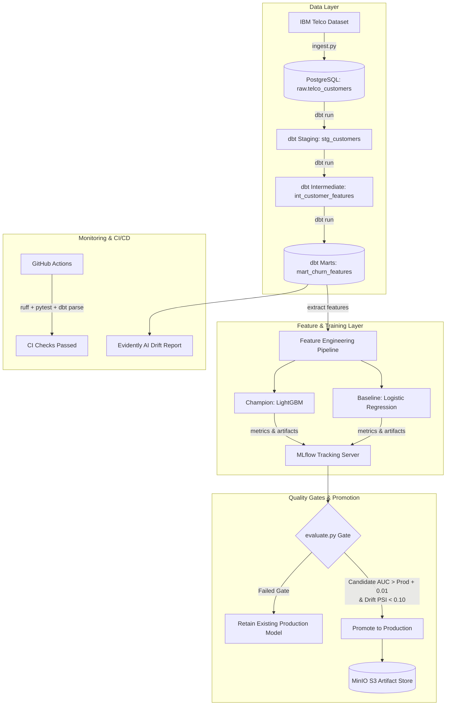

# 🔄 Production Customer Churn Prediction & Retention Pipeline

[](https://github.com/Alokkr00/Customer-Churn-Pipeline/actions)
[](https://www.python.org/downloads/release/python-3110/)
[](https://www.getdbt.com/)
[](https://mlflow.org/)
[](https://docs.docker.com/compose/)
[](https://github.com/psf/black)

An end-to-end, production-grade Machine Learning and Data Engineering pipeline designed to predict customer churn, rank customer risk tiers, and automate retention decision-making.

---

## 📌 1. Business Framing

### The Problem
Acquiring a new customer costs **5–7× more** than retaining an existing one. In recurring subscription businesses (telecom, SaaS, e-commerce), reactive customer support is ineffective because customers churn silently before reaching out.

### The Solution
An automated, production-style MLOps pipeline that:
1. Ingests customer touchpoints and billing events daily into PostgreSQL.
2. Builds clean, auditable dimensional models and feature marts via **dbt**.
3. Trains baseline and gradient boosted models (LightGBM) logged to **MLflow**.
4. Enforces strict **automated model promotion gates** (`AUC improvement >= +0.01` and `drift score <= threshold`).
5. Generates high-risk lists with actionable churn risk probability scores.
6. Operates under full **CI/CD** automation with automated linting, schema validation, and unit tests.

### Business & ML Success Metrics
* **Model AUC / PR-AUC**: Target ROC-AUC $\ge 0.84$.
* **Precision@20%**: Measures the churn capture rate among the top quintile highest-risk customers flagged for proactive outreach.
* **Pipeline SLA & Latency**: Full batch scoring run completed within schedule window.
* **Data & Prediction Drift**: Monitored via Population Stability Index (PSI) and Kolmogorov-Smirnov statistical tests.

---

## 🏗️ 2. Architecture Diagram



---

## 🛠️ 3. Tech Stack

| Layer | Technology | Purpose |
|---|---|---|
| **Local Infrastructure** | Docker Compose | One-command spinup of Postgres, Airflow, MLflow, MinIO |
| **Data Store** | PostgreSQL 15 | Relational data warehouse, raw storage & feature mart |
| **Data Transformation** | dbt-core + dbt-postgres | Version-controlled, testable SQL transformations |
| **ML Training & Pipelines** | Scikit-learn, LightGBM | Feature pipelines, baseline & champion gradient boosting |
| **Experiment Tracking** | MLflow | Model artifact logging, metrics tracking, model registry |
| **Artifact Storage** | MinIO | S3-compatible local object storage for MLflow artifacts |
| **Monitoring** | Evidently AI / Scipy | Automated feature drift and prediction PSI calculations |
| **CI / CD** | GitHub Actions | Pull Request linting, unit testing, and dbt validation |

---

## 📂 4. Project Layout

```text
customer-churn-pipeline/
├── .github/
│   └── workflows/
│       └── ci.yml                 # PR & push validation (ruff, black, pytest, dbt parse)
├── airflow/                       # Airflow DAGs and plugins
│   ├── dags/
│   ├── logs/
│   └── plugins/
├── dbt/                           # dbt transformation models
│   ├── models/
│   │   ├── staging/
│   │   │   ├── stg_customers.sql
│   │   │   └── schema.yml
│   │   ├── intermediate/
│   │   │   ├── int_customer_features.sql
│   │   │   └── schema.yml
│   │   └── marts/
│   │       ├── mart_churn_features.sql
│   │       └── schema.yml
│   ├── dbt_project.yml
│   └── profiles.yml
├── scripts/
│   └── init_db.sql                # Postgres initialization (databases, schemas, tables)
├── src/
│   ├── data/
│   │   ├── ingest.py              # Ingest dataset to raw.telco_customers
│   │   └── preprocess.py          # Data cleaning and staging
│   ├── features/
│   │   └── feature_engineering.py # Scikit-learn ColumnTransformer pipeline
│   ├── training/
│   │   ├── train.py               # Train LogReg + LightGBM, log to MLflow
│   │   └── evaluate.py            # Model promotion gate (AUC delta + drift)
│   └── monitoring/
│       └── drift.py               # Evidently & statistical drift reports
├── tests/
│   ├── unit/
│   │   ├── test_features.py       # Preprocessor and feature tests
│   │   └── test_evaluate.py       # Metrics, PSI, and promotion logic tests
├── docker-compose.yml             # Postgres, MinIO, MLflow, Airflow
├── Makefile                       # Developer shortcuts
├── requirements.txt               # Pinned dependencies
├── pyproject.toml                 # Package definition & tool configs
└── README.md
```

---

## 🚀 5. Quickstart Guide

### Prerequisites
- Python 3.10 or 3.11
- Docker Desktop installed and running
- `make` (optional, or run commands directly)

### Step 1: Clone and Configure Environment
```bash
# Clone the repository
git clone https://github.com/your-org/customer-churn-pipeline.git
cd customer-churn-pipeline

# Copy environment variables
cp .env.example .env

# Create and activate Python virtual environment
python -m venv .venv
source .venv/bin/activate  # On Windows: .venv\Scripts\activate

# Install dependencies
pip install -r requirements.txt
pip install -e .
```

### Step 2: Start Local Infrastructure
Start PostgreSQL, MinIO, MLflow, and Airflow via Docker Compose:
```bash
make up
# Or: docker compose up -d
```

Verify running services:
* **PostgreSQL**: `localhost:5432` (`churn_db`, user: `churn_user`)
* **MLflow UI**: `http://localhost:5000`
* **MinIO Console**: `http://localhost:9001` (user: `minioadmin`, pass: `minioadmin`)
* **Airflow Webserver**: `http://localhost:8080` (user: `admin`, pass: `admin`)

### Step 3: Run Ingestion and dbt Transformations
```bash
# Ingest raw dataset into raw.telco_customers
make ingest

# Run dbt transformations (staging -> intermediate -> marts)
make dbt-run

# Run dbt data tests
make dbt-test
```

### Step 4: Train Models & Log to MLflow
```bash
make train
```
This trains:
- Baseline: **Logistic Regression**
- Champion Candidate: **LightGBM Classifier**

Metrics (ROC-AUC, PR-AUC, F1, Precision@20%) and model pipelines are logged directly to the local MLflow server at `http://localhost:5000`.

### Step 5: Evaluate Quality Gate and Promote Model
```bash
make evaluate
```
Enforces the **Production Quality Gate**:
$$\Delta \text{AUC} \ge 0.01 \quad \text{AND} \quad \text{PSI Drift} \le 0.10$$
If candidate qualifies, it is automatically cached and promoted to Production.

### Step 6: Generate Data Drift Report
```bash
make drift
```
Generates an interactive HTML drift report in `reports/data_drift_report.html` and summary metrics in `reports/drift_summary.json`.

---

## 🧪 6. Testing & Code Quality

Run tests and linters locally before submitting pull requests:

```bash
# Run unit tests with coverage
make test

# Run code linter
make lint

# Auto-format codebase
make format
```

---

## 🗺️ 7. Project Roadmap

- [x] **Phase 1: Foundation** – Docker Compose (Postgres, MinIO, MLflow, Airflow), raw ingestion, dbt models, CI workflow.
- [x] **Phase 2: Features & Training** – Feature engineering pipeline, LightGBM training, MLflow tracking, automated promotion gate, drift checks.
- [ ] **Phase 3: Scoring & Serving** – Daily batch Airflow DAG, FastAPI real-time/batch prediction endpoints, interactive Streamlit retention dashboard.
- [ ] **Phase 4: Production Practices** – Full CD promotion workflows, Slack/email alerts on high-risk spikes, containerized serving.
- [ ] **Phase 5: Polish & Cloud** – Terraform IaC modules, cloud deployment recipes (AWS ECS / GCP Cloud Run).
